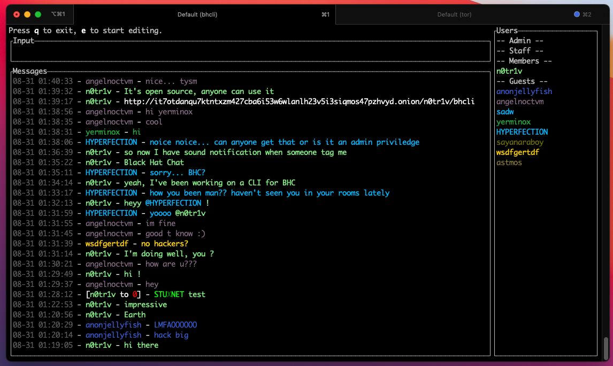

# BHCLI

## Description

This is a CLI client for any of [le-chat-php](https://github.com/DanWin/le-chat-php)  
currently supported chats are [Black Hat Chat](http://blkhatjxlrvc5aevqzz5t6kxldayog6jlx5h7glnu44euzongl4fh5ad.onion) and
[Daniel's chat](http://danschat356lctri3zavzh6fbxg2a7lo6z3etgkctzzpspewu7zdsaqd.onion)

## Pre-built binaries

Pre-buit binaries can be found on the [official website](http://dkforestseeaaq2dqz2uflmlsybvnq2irzn4ygyvu53oazyorednviid.onion/bhcli)

## Features

- Sound notifications when tagged/pmmed
- Private messages `/pm username message`
- Kick someone `/kick username message` | `/k username message`
- Delete last message `/dl`
- Delete last X message `/dl5` will delete the last 5 messages
- Delete all messages `/dall`
- Ignore someone `/ignore username`
- Unignore someone `/unignore username`
- Toggle notifications sound `m`
- Toggle a "guest" view, by filtering out PMs and "Members chat" `shift+G`
- Filter messages `/f terms`
- Copy a selected message to clipboard `ctrl+C` | `y`
- Copy the first link in a message to clipboard `shift+Y`
- Directly tag author of selected message `t` will prefil the input with `@username `
- Directly private message author of selected message `p` will prefil the input with `/pm username `
- Shortcut to kick author of selected message `ctrl+k` will prefil the input with `/kick username `
- captcha is displayed directly in terminal 10 times the real size
- Upload file `/u C:\path\to\file.png @username message` (@username is optional) `@members` for members group
- `<tab>` to autocomplete usernames while typing

### Editing mode
- `ctrl+A` Move cursor to start of line
- `ctrl+E` Move cursor to end of line
- `ctrl+F` Move cursor a word forward
- `ctrl+B` Move cursor a word backward

### Messages navigation
- Page down the messages list `ctrl+D` | `page down`
- Page up the messages list `ctrl+U` | `page up`
- Going down 1 message `j` | `down arrow`
- Going up 1 message `k` | `up arrow`

## Build from source

### Windows

- Install C++ build tools https://visualstudio.microsoft.com/visual-cpp-build-tools/
- Install Rust https://www.rust-lang.org/learn/get-started
- Download & extract code source
- Compile with `cargo build --release`

### OSx

- Install Rust https://www.rust-lang.org/learn/get-started
- Compile with `cargo build --release`

### Linux

- Install Rust
- Install dependencies `apt-get install -y pkg-config libasound2-dev libssl-dev cmake libfreetype6-dev libexpat1-dev libxcb-composite0-dev libx11-dev`
- Compile with `cargo build --release`

## Cross compile

`cargo build --release --target x86_64-pc-windows-gnu`
